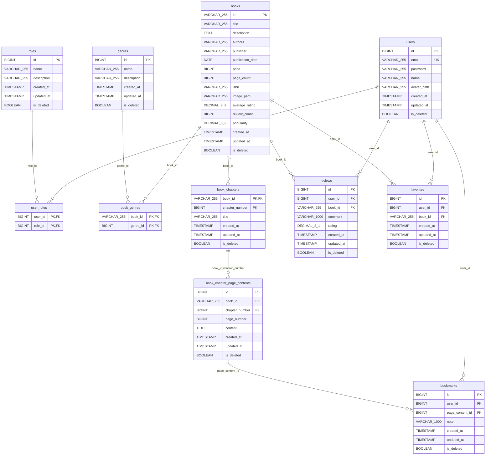

# My Books Backend - データベース設計ガイド（新人研修向け）

## 目次
1. [概要とER図](#概要とer図)
2. [学習の進め方](#学習の進め方)
3. [基本テーブル群（認証・権限）](#基本テーブル群認証権限)
4. [コンテンツ管理テーブル群](#コンテンツ管理テーブル群)
5. [ユーザー操作テーブル群](#ユーザー操作テーブル群)
6. [階層構造テーブル群](#階層構造テーブル群)
7. [パフォーマンス最適化](#パフォーマンス最適化)
8. [Spring Boot開発への接続](#spring-boot開発への接続)

---

## 概要とER図

### システム概要
My Books Backendは、オンライン書籍管理システムです。ユーザー認証、書籍管理、レビュー機能、お気に入り、ブックマーク機能を提供します。

### ER図


---

## 学習の進め方

このデータベース設計は、Spring Boot開発を段階的に学習できるよう、以下の順序で理解することを推奨します：

### 学習ステップ
1. **基本テーブル群** - ユーザー認証とロール管理（1対多、多対多の基本）
2. **コンテンツ管理テーブル群** - 書籍とジャンル（多対多関係）
3. **ユーザー操作テーブル群** - レビュー、お気に入り（ユーザーアクション）
4. **階層構造テーブル群** - 書籍の章とページ（複合主キー）
5. **パフォーマンス最適化** - インデックス戦略

### 各ステップで学ぶこと
- **データベース設計原則** - 正規化、外部キー制約
- **JPA/Hibernateマッピング** - Entity、Repository設計
- **Spring Securityとの連携** - 認証・認可の実装
- **API設計** - REST エンドポイントの設計

---

## 基本テーブル群（認証・権限）

### 1. users テーブル
ユーザー情報を管理する中核テーブル

```sql
CREATE TABLE `users` (
  `id` BIGINT NOT NULL AUTO_INCREMENT PRIMARY KEY,
  `email` VARCHAR(255) NOT NULL UNIQUE,
  `password` VARCHAR(255) NOT NULL DEFAULT '',
  `name` VARCHAR(255) NOT NULL DEFAULT '',
  `avatar_path` VARCHAR(255) DEFAULT NULL,
  `created_at` TIMESTAMP DEFAULT CURRENT_TIMESTAMP,
  `updated_at` TIMESTAMP DEFAULT CURRENT_TIMESTAMP ON UPDATE CURRENT_TIMESTAMP,
  `is_deleted` BOOLEAN NOT NULL DEFAULT FALSE
);
```

#### 設計のポイント
- **主キー**: `id` (BIGINT AUTO_INCREMENT) - 一意性保証
- **ユニークキー**: `email` - ログイン時の識別子
- **パスワード**: BCryptで暗号化されたハッシュ値を格納
- **論理削除**: `is_deleted` フラグで削除管理
- **タイムスタンプ**: 作成・更新時刻を自動管理

#### Spring Bootでの活用
```java
@Entity
@Table(name = "users")
public class User implements UserDetails {
    @Id
    @GeneratedValue(strategy = GenerationType.IDENTITY)
    private Long id;
    
    @Column(unique = true)
    private String email;
    
    // Spring Securityとの連携
    @ManyToMany(fetch = FetchType.EAGER)
    @JoinTable(name = "user_roles")
    private Set<Role> roles;
}
```

#### 新人へのポイント
- **なぜBCryptか？**: パスワードを平文で保存するのは危険。BCryptは一方向ハッシュ化でセキュリティを確保
- **論理削除とは？**: データを物理的に削除せず、フラグで「削除済み」として扱う方式。データの復旧やトレーサビリティが可能
- **タイムスタンプ自動更新**: MySQLの機能でデータの作成・更新日時を自動で記録

### 2. roles テーブル
ロール（権限）情報を管理

```sql
CREATE TABLE `roles` (
  `id` BIGINT NOT NULL AUTO_INCREMENT PRIMARY KEY,
  `name` VARCHAR(255) NOT NULL DEFAULT '',
  `description` VARCHAR(255) NOT NULL DEFAULT '',
  `created_at` TIMESTAMP DEFAULT CURRENT_TIMESTAMP,
  `updated_at` TIMESTAMP DEFAULT CURRENT_TIMESTAMP ON UPDATE CURRENT_TIMESTAMP,
  `is_deleted` BOOLEAN NOT NULL DEFAULT FALSE
);
```

#### 初期データ
```sql
INSERT INTO `roles` (`name`, `description`) VALUES
('ROLE_ADMIN', '管理者権限'),
('ROLE_USER', 'ユーザー権限');
```

#### 設計のポイント
- **Spring Security連携**: `ROLE_` プレフィックスでロール管理
- **拡張性**: 将来的な権限追加に対応

#### 新人へのポイント
- **ロールベースアクセス制御（RBAC）**: ユーザーに直接権限を付与するのではなく、ロール（役割）を介して権限を管理する方式
- **Spring Securityのルール**: `ROLE_` プレフィックスは Spring Security の慣例

### 3. user_roles テーブル（中間テーブル）
ユーザーとロールの多対多関係を管理

```sql
CREATE TABLE `user_roles` (
  `user_id` BIGINT NOT NULL,
  `role_id` BIGINT NOT NULL,
  PRIMARY KEY (`user_id`, `role_id`),
  FOREIGN KEY (`user_id`) REFERENCES `users`(`id`) ON DELETE CASCADE,
  `role_id`) REFERENCES `roles`(`id`) ON DELETE CASCADE
);
```

#### 設計のポイント
- **複合主キー**: (user_id, role_id) で一意性保証
- **CASCADE削除**: ユーザー削除時に関連レコードも削除
- **多対多関係**: 1人のユーザーが複数のロールを持てる

#### 新人へのポイント
- **多対多関係の実現**: データベースでは中間テーブルを使って多対多関係を表現
- **複合主キー**: 複数の列の組み合わせで一意性を保証
- **CASCADE削除**: 親レコードが削除されたとき、関連する子レコードも自動削除

#### JPA での多対多マッピング例
```java
@Entity
public class User {
    @ManyToMany
    @JoinTable(
        name = "user_roles",
        joinColumns = @JoinColumn(name = "user_id"),
        inverseJoinColumns = @JoinColumn(name = "role_id")
    )
    private Set<Role> roles;
}
```

---

## コンテンツ管理テーブル群

### 1. books テーブル
書籍情報の中核テーブル

```sql
CREATE TABLE `books` (
  `id` VARCHAR(255) NOT NULL PRIMARY KEY,
  `title` VARCHAR(255) NOT NULL DEFAULT '',
  `description` TEXT NOT NULL,
  `authors` VARCHAR(255) NOT NULL DEFAULT '',
  `publisher` VARCHAR(255) NOT NULL DEFAULT '',
  `publication_date` DATE NOT NULL,
  `price` BIGINT NOT NULL DEFAULT 0,
  `page_count` BIGINT NOT NULL DEFAULT 0,
  `isbn` VARCHAR(255) NOT NULL DEFAULT '',
  `image_path` VARCHAR(255) DEFAULT NULL,
  `average_rating` DECIMAL(3, 2) NOT NULL DEFAULT 0.00,
  `review_count` BIGINT NOT NULL DEFAULT 0,
  `popularity` DECIMAL(8, 2) NOT NULL DEFAULT 0.000,
  `created_at` TIMESTAMP DEFAULT CURRENT_TIMESTAMP,
  `updated_at` TIMESTAMP DEFAULT CURRENT_TIMESTAMP ON UPDATE CURRENT_TIMESTAMP,
  `is_deleted` BOOLEAN NOT NULL DEFAULT FALSE
);
```

#### 設計のポイント
- **文字列主キー**: `id` (VARCHAR) - ビジネス要件による
- **統計フィールド**: `average_rating`, `review_count`, `popularity` - 非正規化による高速化
- **金額**: `price` (BIGINT) - 円単位で格納（小数点回避）

#### 新人へのポイント
- **非正規化とは？**: 正規化とは逆に、計算済みの値をテーブルに保存してクエリ性能を向上させる手法
- **文字列主キー**: 通常は数値型を使うが、ビジネス要件によっては文字列型も選択肢
- **DECIMAL型**: 金額や評価などの正確な小数を扱う場合はFLOATでなくDECIMALを使用

### 2. genres テーブル
ジャンル情報を管理

```sql
CREATE TABLE `genres` (
  `id` BIGINT NOT NULL AUTO_INCREMENT PRIMARY KEY,
  `name` VARCHAR(255) NOT NULL DEFAULT '',
  `description` VARCHAR(255) NOT NULL DEFAULT '',
  `created_at` TIMESTAMP DEFAULT CURRENT_TIMESTAMP,
  `updated_at` TIMESTAMP DEFAULT CURRENT_TIMESTAMP ON UPDATE CURRENT_TIMESTAMP,
  `is_deleted` BOOLEAN NOT NULL DEFAULT FALSE
);
```

### 3. book_genres テーブル（中間テーブル）
書籍とジャンルの多対多関係

```sql
CREATE TABLE `book_genres` (
  `book_id` VARCHAR(255) NOT NULL,
  `genre_id` BIGINT NOT NULL,
  PRIMARY KEY (`book_id`, `genre_id`),
  FOREIGN KEY (`book_id`) REFERENCES `books`(`id`) ON DELETE CASCADE,
  FOREIGN KEY (`genre_id`) REFERENCES `genres`(`id`) ON DELETE CASCADE
);
```

#### 新人へのポイント
- **多対多の実例**: 1冊の本は複数のジャンルに属し、1つのジャンルは複数の本を含む
- **中間テーブルの命名**: `table1_table2` の命名パターンが一般的

#### 学習ポイント - ジャンル検索のクエリ例
```sql
-- 「ミステリー」ジャンルの書籍を検索
SELECT b.title, b.authors 
FROM books b
JOIN book_genres bg ON b.id = bg.book_id
JOIN genres g ON bg.genre_id = g.id
WHERE g.name = 'ミステリー' AND b.is_deleted = false;
```

---

## ユーザー操作テーブル群

### 1. reviews テーブル
書籍レビューを管理

```sql
CREATE TABLE `reviews` (
  `id` BIGINT NOT NULL AUTO_INCREMENT PRIMARY KEY,
  `user_id` BIGINT NOT NULL,
  `book_id` VARCHAR(255) NOT NULL,
  `comment` VARCHAR(1000) NOT NULL DEFAULT '',
  `rating` DECIMAL(2, 1) NOT NULL DEFAULT 0.0 CHECK (`rating` >= 0 AND `rating` <= 5),
  `created_at` TIMESTAMP DEFAULT CURRENT_TIMESTAMP,
  `updated_at` TIMESTAMP DEFAULT CURRENT_TIMESTAMP ON UPDATE CURRENT_TIMESTAMP,
  `is_deleted` BOOLEAN NOT NULL DEFAULT FALSE,
  UNIQUE (`user_id`, `book_id`),
  FOREIGN KEY (`user_id`) REFERENCES `users`(`id`) ON DELETE CASCADE,
  FOREIGN KEY (`book_id`) REFERENCES `books`(`id`) ON DELETE CASCADE
);
```

#### 設計のポイント
- **一意制約**: (user_id, book_id) - 1人1冊1レビューの制約
- **CHECK制約**: rating 0.0-5.0 の範囲制限
- **統計連携**: 書籍の average_rating, review_count を自動更新

#### 新人へのポイント
- **CHECK制約**: データベースレベルでの値の妥当性チェック
- **ビジネスルール**: 1人が同じ本に複数レビューできないようにユニーク制約で制御

### 2. favorites テーブル
お気に入り書籍を管理

```sql
CREATE TABLE `favorites` (
  `id` BIGINT NOT NULL AUTO_INCREMENT PRIMARY KEY,
  `user_id` BIGINT NOT NULL,
  `book_id` VARCHAR(255) NOT NULL,
  `created_at` TIMESTAMP DEFAULT CURRENT_TIMESTAMP,
  `updated_at` TIMESTAMP DEFAULT CURRENT_TIMESTAMP ON UPDATE CURRENT_TIMESTAMP,
  `is_deleted` BOOLEAN NOT NULL DEFAULT FALSE,
  UNIQUE (`user_id`, `book_id`),
  FOREIGN KEY (`user_id`) REFERENCES `users`(`id`) ON DELETE CASCADE,
  FOREIGN KEY (`book_id`) REFERENCES `books`(`id`) ON DELETE CASCADE
);
```

#### 新人へのポイント
- **いいね機能**: SNSでよく見る「いいね」機能のデータベース実装パターン
- **重複防止**: 同じ書籍を複数回お気に入りできない制約

---

## 階層構造テーブル群

### 1. book_chapters テーブル
書籍の章構造を管理

```sql
CREATE TABLE `book_chapters` (
  `book_id` VARCHAR(255) NOT NULL,
  `chapter_number` BIGINT NOT NULL,
  `title` VARCHAR(255) NOT NULL,
  `created_at` TIMESTAMP DEFAULT CURRENT_TIMESTAMP,
  `updated_at` TIMESTAMP DEFAULT CURRENT_TIMESTAMP ON UPDATE CURRENT_TIMESTAMP,
  `is_deleted` BOOLEAN NOT NULL DEFAULT FALSE,
  PRIMARY KEY (`book_id`, `chapter_number`),
  FOREIGN KEY (`book_id`) REFERENCES `books`(`id`) ON DELETE CASCADE
);
```

#### 設計のポイント
- **複合主キー**: (book_id, chapter_number) - 書籍内での章番号一意性
- **順序管理**: chapter_number で章の順序を管理

#### 新人へのポイント
- **複合主キーの用途**: 「書籍A の第1章」のように、複数の要素で一意性を保証したい場合
- **章番号**: 1から始まる連番で章の順序を表現

#### Spring Boot での複合主キー実装
```java
@Entity
@Table(name = "book_chapters")
public class BookChapter {
    @EmbeddedId
    private BookChapterId id;
    
    private String title;
}

@Embeddable
public class BookChapterId implements Serializable {
    @Column(name = "book_id")
    private String bookId;
    
    @Column(name = "chapter_number") 
    private Long chapterNumber;
}
```

### 2. book_chapter_page_contents テーブル
書籍ページの実際のコンテンツを管理

```sql
CREATE TABLE `book_chapter_page_contents` (
  `id` BIGINT NOT NULL AUTO_INCREMENT PRIMARY KEY,
  `book_id` VARCHAR(255) NOT NULL,
  `chapter_number` BIGINT NOT NULL,
  `page_number` BIGINT NOT NULL,
  `content` TEXT NOT NULL,
  `created_at` TIMESTAMP DEFAULT CURRENT_TIMESTAMP,
  `updated_at` TIMESTAMP DEFAULT CURRENT_TIMESTAMP ON UPDATE CURRENT_TIMESTAMP,
  `is_deleted` BOOLEAN NOT NULL DEFAULT FALSE,
  UNIQUE (`book_id`, `chapter_number`, `page_number`),
  FOREIGN KEY (`book_id`, `chapter_number`) REFERENCES `book_chapters`(`book_id`, `chapter_number`) ON DELETE CASCADE
);
```

#### 設計のポイント
- **三重一意制約**: (book_id, chapter_number, page_number) - ページの一意性
- **複合外部キー**: book_chapters への参照
- **コンテンツ格納**: TEXT型で実際の書籍内容を格納

#### 新人へのポイント
- **複合外部キー**: 複合主キーを持つテーブルへの外部キー参照
- **TEXT型**: 長いテキストデータを格納する型（VARCHARより大容量）

### 3. bookmarks テーブル
ユーザーのブックマーク機能

```sql
CREATE TABLE `bookmarks` (
  `id` BIGINT NOT NULL AUTO_INCREMENT PRIMARY KEY,
  `user_id` BIGINT NOT NULL,
  `page_content_id` BIGINT NOT NULL,
  `note` VARCHAR(1000) NOT NULL DEFAULT '',
  `created_at` TIMESTAMP DEFAULT CURRENT_TIMESTAMP,
  `updated_at` TIMESTAMP DEFAULT CURRENT_TIMESTAMP ON UPDATE CURRENT_TIMESTAMP,
  `is_deleted` BOOLEAN NOT NULL DEFAULT FALSE,
  UNIQUE (`user_id`, `page_content_id`),
  FOREIGN KEY (`user_id`) REFERENCES `users`(`id`) ON DELETE CASCADE,
  FOREIGN KEY (`page_content_id`) REFERENCES `book_chapter_page_contents`(`id`) ON DELETE CASCADE
);
```

#### 新人へのポイント
- **階層参照**: ページレベルでの精密なブックマーク（書籍→章→ページ）
- **ユーザーメモ**: ブックマークと一緒にメモも保存できる仕様

---

## パフォーマンス最適化

### インデックス戦略

#### 1. 基本インデックス
```sql
-- 検索用インデックス
CREATE INDEX idx_books_title ON books(title);
CREATE INDEX idx_books_authors ON books(authors);
CREATE INDEX idx_users_email ON users(email);

-- 論理削除フィルタ用
CREATE INDEX idx_books_deleted ON books(is_deleted);
CREATE INDEX idx_users_deleted ON users(is_deleted);
```

#### 2. ソート用インデックス
```sql
-- 書籍一覧の並び替え
CREATE INDEX idx_books_popularity_desc ON books(popularity DESC, is_deleted);
CREATE INDEX idx_books_publication_date_desc ON books(publication_date DESC, is_deleted);
CREATE INDEX idx_books_average_rating_desc ON books(average_rating DESC, is_deleted);
```

#### 新人へのポイント
- **インデックスとは？**: データベースの「索引」。検索を高速化するための仕組み
- **複合インデックス**: 複数列を組み合わせたインデックス。WHERE句やORDER BY句で使用される列順に作成

#### 3. カバリングインデックス（高度な最適化）
```sql
-- 書籍一覧取得の完全最適化（人気順）
CREATE INDEX idx_books_list_popularity_covering ON books(
    is_deleted, 
    popularity DESC, 
    id, 
    title, 
    authors, 
    average_rating, 
    review_count, 
    image_path, 
    publication_date, 
    price, 
    page_count
);
```

#### 新人へのポイント
- **カバリングインデックス**: 必要なデータがすべてインデックス内に含まれ、実際のテーブルデータにアクセスしなくて済む最適化手法
- **I/O削減**: 最大90%のI/O削減効果が期待できる

### 統計更新戦略

#### 書籍統計の自動更新
```sql
-- 評価点平均の自動更新
UPDATE books b
SET average_rating = (
    SELECT COALESCE(ROUND(AVG(r.rating), 2), 0.00)
    FROM reviews r 
    WHERE r.book_id = b.id AND r.is_deleted = false
);

-- 人気度計算（重み付きスコア）
UPDATE books b
SET popularity = (
    CASE 
        WHEN b.review_count = 0 OR b.average_rating = 0.0 THEN 0.00
        ELSE ROUND(b.average_rating * LN(b.review_count + 1) * 20, 2)
    END
);
```

#### 新人へのポイント
- **非正規化の管理**: 集計データを保存した場合、元データ変更時の同期が重要
- **バッチ処理**: 統計更新は通常、夜間バッチで実行

---

## Spring Boot開発への接続

### 1. Entity設計の指針

#### 基本Entityパターン
```java
@Entity
@Table(name = "books")
public class Book extends EntityBase {
    @Id
    private String id;
    
    @Column(nullable = false)
    private String title;
    
    // 統計フィールド（非正規化）
    @Column(name = "average_rating")
    private BigDecimal averageRating;
    
    @Column(name = "review_count")
    private Long reviewCount;
    
    // 関係マッピング
    @ManyToMany
    @JoinTable(name = "book_genres")
    private Set<Genre> genres;
    
    @OneToMany(mappedBy = "book")
    private List<Review> reviews;
}
```

#### 新人へのポイント
- **EntityBase**: 共通フィールド（id, createdAt, updatedAt, isDeleted）を継承
- **@Column**: データベースカラムとJavaフィールドのマッピング
- **関係アノテーション**: @ManyToMany, @OneToMany などでテーブル間の関係を表現

### 2. Repository設計パターン

#### 基本Repository
```java
@Repository
public interface BookRepository extends JpaRepository<Book, String> {
    // 論理削除対応
    List<Book> findByIsDeletedFalse(Pageable pageable);
    
    // タイトル検索
    @Query("SELECT b FROM Book b WHERE b.title LIKE %:keyword% AND b.isDeleted = false")
    Page<Book> searchByTitle(@Param("keyword") String keyword, Pageable pageable);
    
    // ジャンル検索（JOIN）
    @Query("SELECT DISTINCT b FROM Book b JOIN b.genres g WHERE g.id IN :genreIds AND b.isDeleted = false")
    Page<Book> findByGenres(@Param("genreIds") List<Long> genreIds, Pageable pageable);
}
```

#### N+1問題対策
```java
@Repository
public interface BookmarkRepository extends JpaRepository<Bookmark, Long> {
    // JOIN FETCH でN+1問題を解決
    @Query("SELECT b FROM Bookmark b " +
           "LEFT JOIN FETCH b.pageContent pc " +
           "LEFT JOIN FETCH pc.book " +
           "WHERE b.id IN :ids")
    List<Bookmark> findAllByIdInWithRelations(@Param("ids") List<Long> ids);
}
```

#### 新人へのポイント
- **JpaRepository**: Spring Data JPA の基本リポジトリインターフェース
- **N+1問題**: 1つのクエリで取得したデータに対して、関連データを取得するために追加でN回クエリが実行される問題
- **JOIN FETCH**: 関連データを一度に取得してN+1問題を解決

### 3. Service層設計パターン

#### トランザクション管理
```java
@Service
@Transactional
public class ReviewServiceImpl implements ReviewService {
    
    @Override
    public ReviewResponse createReview(Long userId, CreateReviewRequest request) {
        // 1. レビュー作成
        Review review = reviewRepository.save(newReview);
        
        // 2. 非同期で統計更新
        bookStatsService.updateBookStatsAsync(request.getBookId());
        
        return reviewMapper.toResponse(review);
    }
}
```

#### 非同期処理
```java
@Service
public class BookStatsServiceImpl implements BookStatsService {
    
    @Async
    @Override
    public void updateBookStatsAsync(String bookId) {
        // 統計の非同期更新
        updateAverageRating(bookId);
        updateReviewCount(bookId);
        updatePopularity(bookId);
    }
}
```

#### 新人へのポイント
- **@Transactional**: データベーストランザクションの管理
- **@Async**: 非同期処理の実行（重い処理をバックグラウンドで実行）

### 4. セキュリティ設計

#### エンドポイント保護
```java
@Configuration
@EnableWebSecurity
public class SecurityConfig {
    
    @Bean
    public SecurityFilterChain filterChain(HttpSecurity http) throws Exception {
        return http
            .authorizeHttpRequests(auth -> auth
                .requestMatchers(HttpMethod.GET, "/books/**").permitAll()
                .requestMatchers("/content/**").authenticated()
                .anyRequest().authenticated()
            )
            .build();
    }
}
```

#### 新人へのポイント
- **認証 vs 認可**: 認証は「誰か」の確認、認可は「何ができるか」の制御
- **Spring Security**: Springにおけるセキュリティフレームワーク

---

## 学習の次のステップ

### 1. 実装順序の推奨
1. **基本Entity作成** - User, Role, Book, Genre
2. **認証機能実装** - Spring Security との連携
3. **基本CRUD操作** - Repository, Service, Controller
4. **関係マッピング** - 多対多、1対多の実装
5. **複合主キー** - BookChapter, PageContent
6. **パフォーマンス最適化** - インデックス、N+1問題対策

### 2. 発展的なトピック
- **キャッシュ戦略** - Spring Cache の活用
- **監査機能** - JPA Auditing
- **全文検索** - Elasticsearch との連携
- **ファイル管理** - 画像アップロード機能
- **API設計** - RESTful設計原則

### 3. テスト戦略
- **Repository層** - @DataJpaTest
- **Service層** - @MockBean を使った単体テスト
- **Controller層** - @WebMvcTest
- **統合テスト** - @SpringBootTest

### 4. 実際のSQL例で理解を深める

#### 基本的な検索クエリ
```sql
-- 人気順で書籍一覧を取得
SELECT * FROM books 
WHERE is_deleted = false 
ORDER BY popularity DESC, created_at DESC 
LIMIT 20;
```

#### JOIN を使った複雑なクエリ
```sql
-- ユーザーのお気に入り書籍とジャンルを取得
SELECT b.title, b.authors, GROUP_CONCAT(g.name) as genres
FROM favorites f
JOIN books b ON f.book_id = b.id
JOIN book_genres bg ON b.id = bg.book_id
JOIN genres g ON bg.genre_id = g.id
WHERE f.user_id = 1 AND f.is_deleted = false
GROUP BY b.id;
```

#### 統計クエリ
```sql
-- 書籍の平均評価を計算
SELECT b.title, AVG(r.rating) as avg_rating, COUNT(r.id) as review_count
FROM books b
LEFT JOIN reviews r ON b.id = r.book_id AND r.is_deleted = false
WHERE b.is_deleted = false
GROUP BY b.id;
```

---

## まとめ

このデータベース設計を理解することで、現代的なSpring Bootアプリケーションの開発スキルが体系的に身につきます。

### 重要な学習ポイント
1. **段階的理解**: 簡単なテーブルから複雑な関係まで順序立てて学習
2. **実践的な設計**: 実際のWebアプリケーションで使われる設計パターン
3. **パフォーマンス意識**: 単なる動作だけでなく、性能も考慮した設計
4. **Spring Boot連携**: データベース設計がどのようにJavaコードに翻訳されるか

各テーブルの設計思想を理解し、段階的に実装を進めることで、実践的な開発力を養成できます。わからない部分があれば、いつでも質問してください！